# Latest Flutter for Web Rendering issue

## Introduction
It's reveled that flutter has memory leaks issue with the latest versions used on web

Chrome version: Version 132.0.6834.160 (Official Build) (arm64)
Safari version: Version 18.2 (20620.1.16.11.8)
ipad Air M1 Ipad OS 18.2.1 

## command to compile web server
flutter build web

## Flutter 3.27.3 
summery:
Mac Chrome: 64Mb
Mac Safari: 820Mb
Safari iPad: 387Mb
## Image 1: Basic Counter App on Mac Chrome  
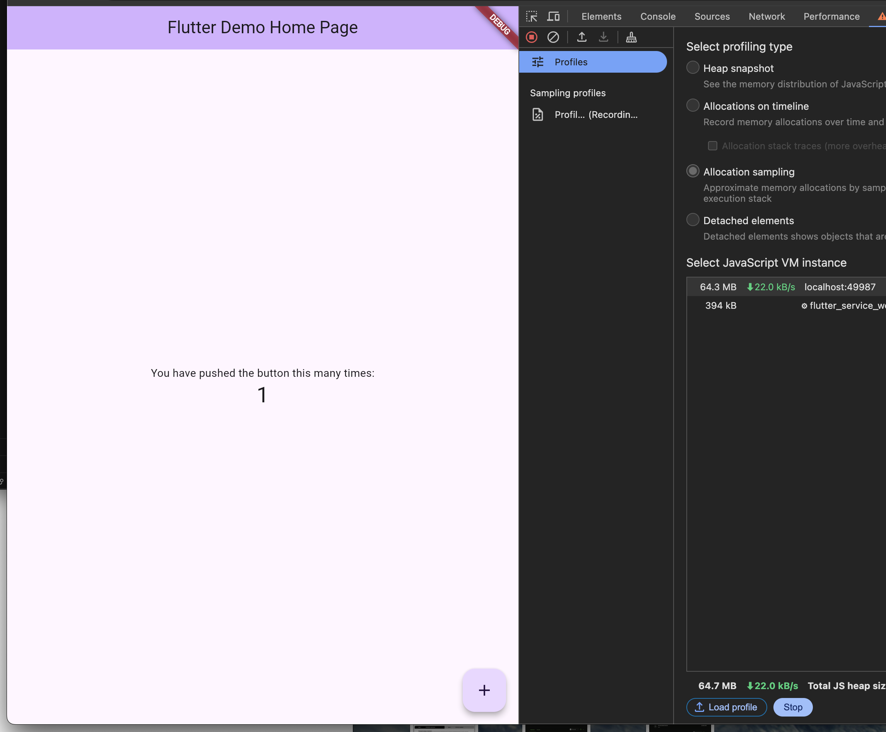

## Image 2: Basic Counter App on Mac Safari  
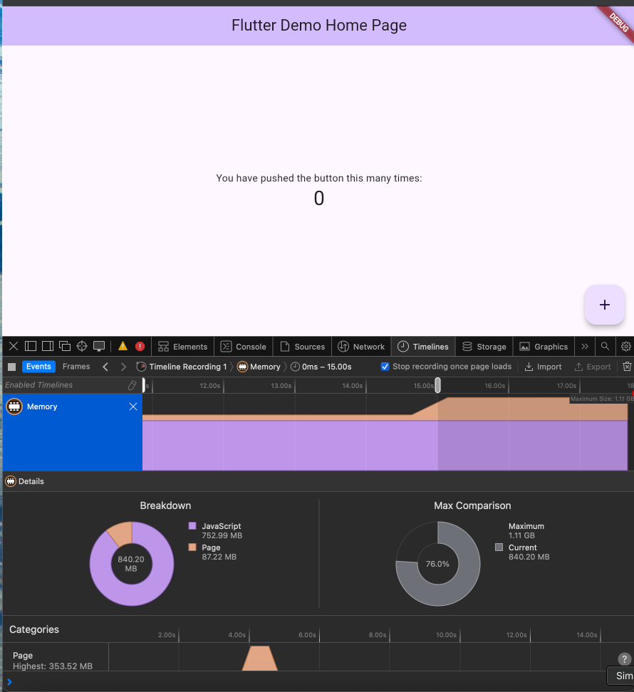

## Image 3: Basic Counter App on Safari iPad  
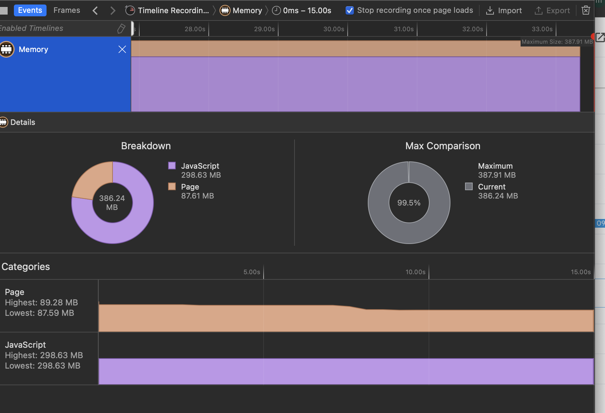

## Flutter 3.24.0
summery:
Mac Chrome: 22Mb
Mac Safari: 807Mb
Safari iPad: 389Mb  
summery canvaskit:
Mac chrome: 22Mb
Mac Safari: 664Mb
Ipad Safari: 423Mb
## Image 1: Basic Counter App on Mac Chrome  
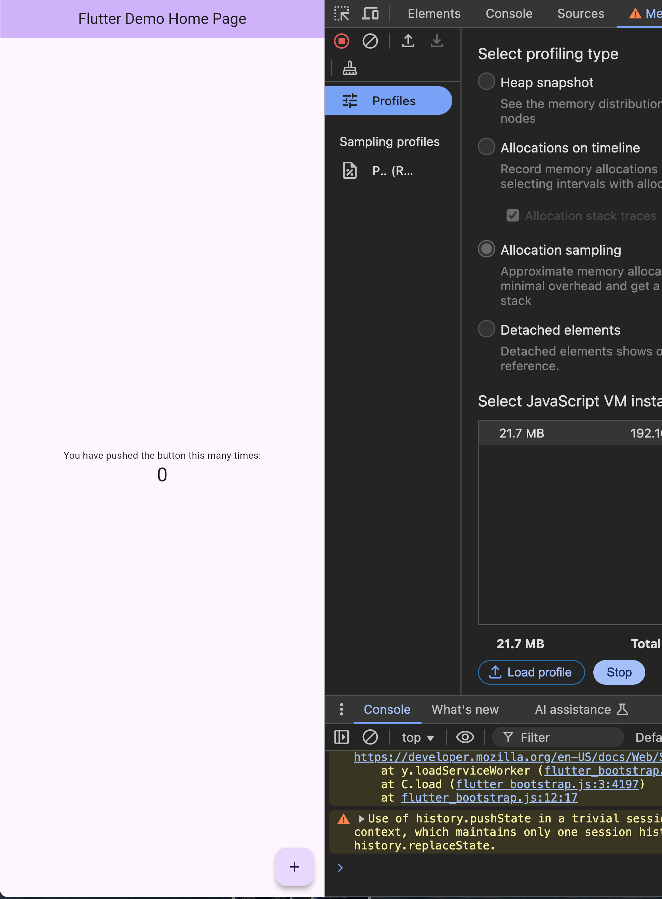

## Image 2: Basic Counter App on Mac Safari  
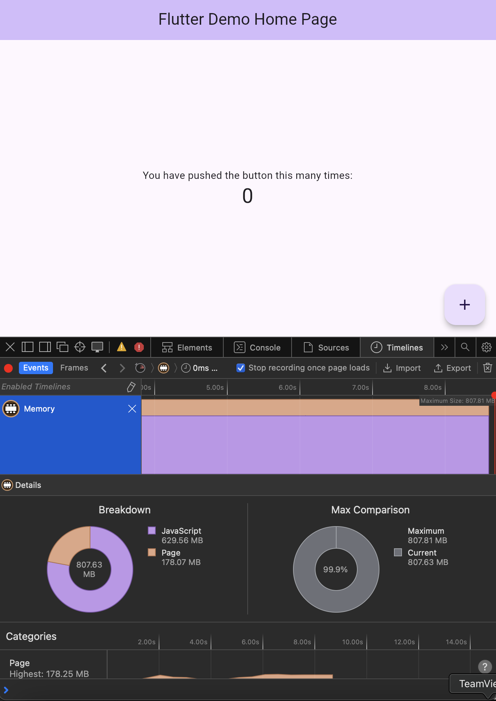

## Image 3: Basic Counter App on Safari iPad  
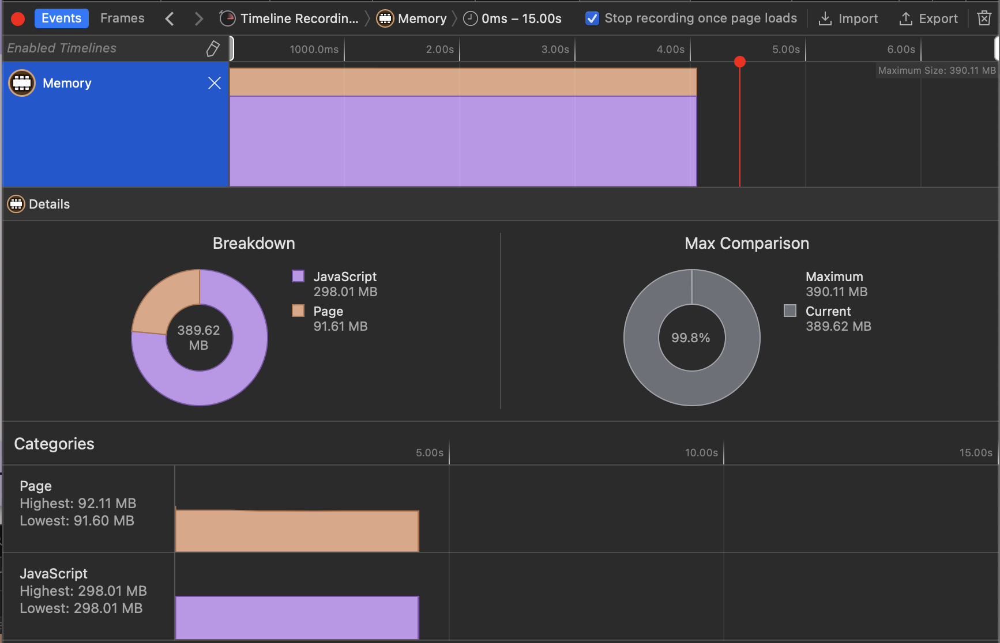

## Flutter 3.22.2
summery:
Mac Chrome: 18Mb
Mac Safari: 400Mb
Safari iPad: 68Mb  

summery canvaskit:
Mac chrome: 32Mb
Mac Safari: 400Mb
Ipad Safari: 411Mb
## Image 1: Basic Counter App on Mac Chrome  
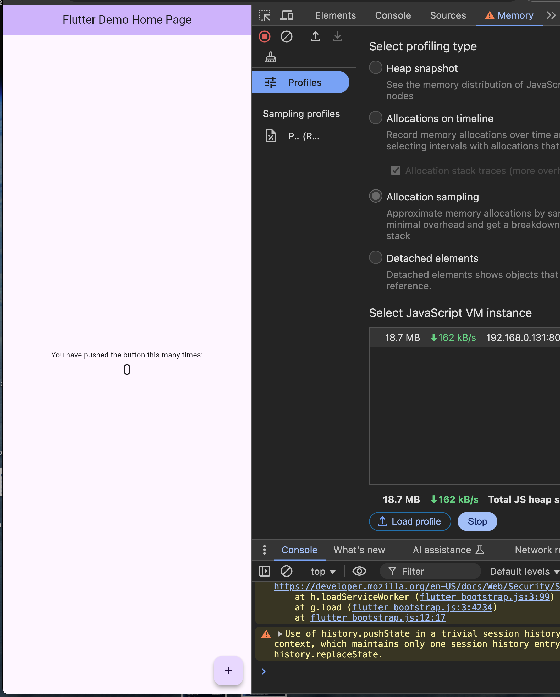

## Image 2: Basic Counter App on Mac Safari  
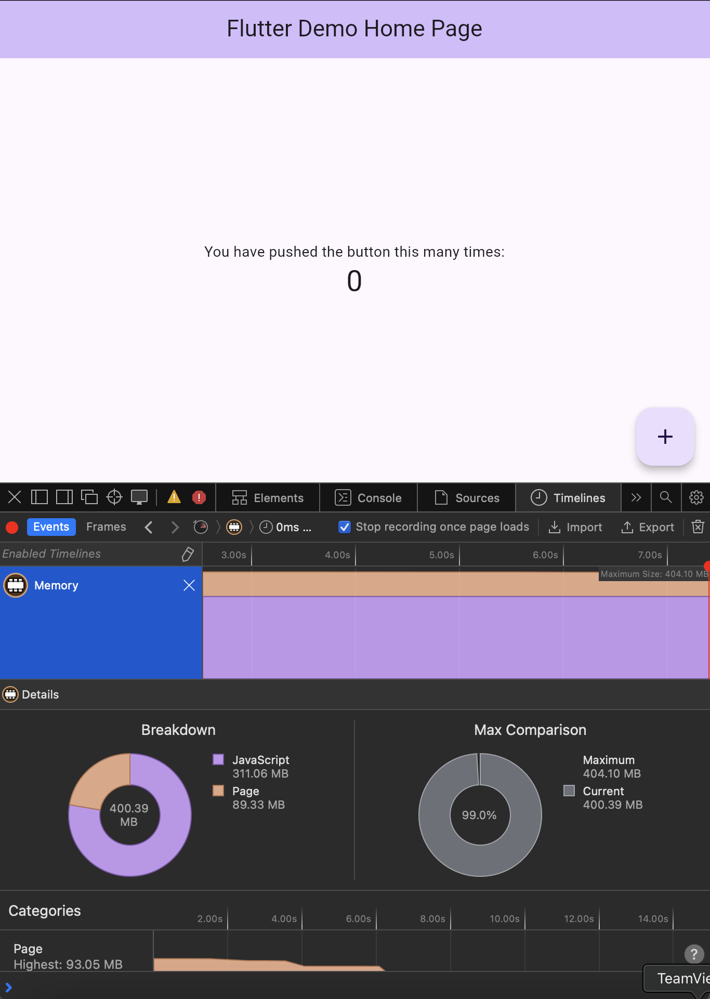

## Image 3: Basic Counter App on Safari iPad  
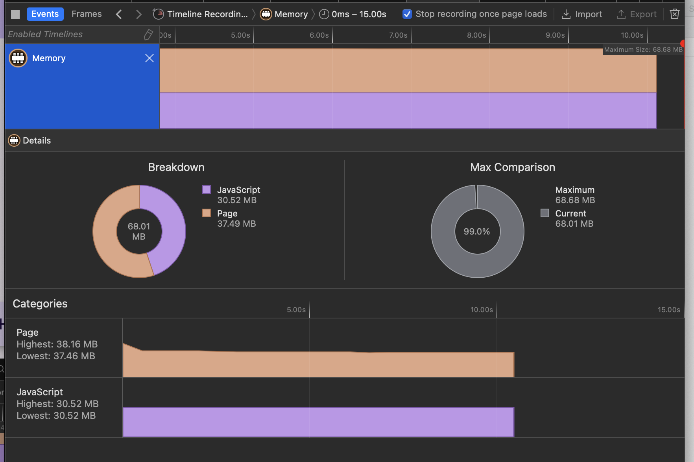

## Flutter 3.19.6
summery:
Mac Chrome: 21Mb
Mac Safari: 1.05Gb
Safari iPad: 431Mb
## Image 1: Basic Counter App on Mac Chrome  
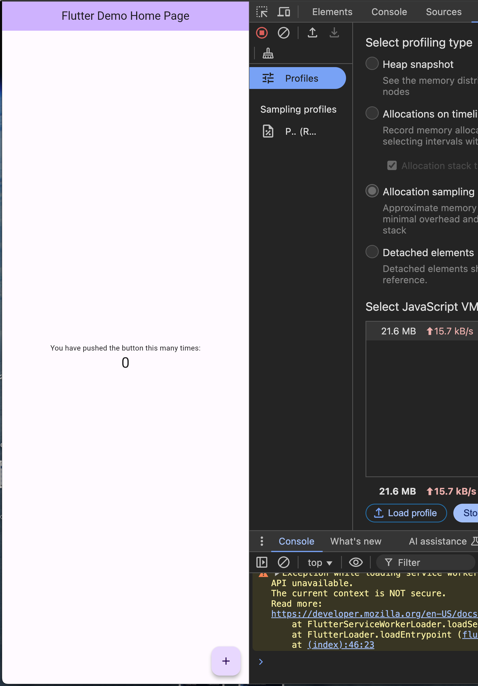

## Image 2: Basic Counter App on Mac Safari  
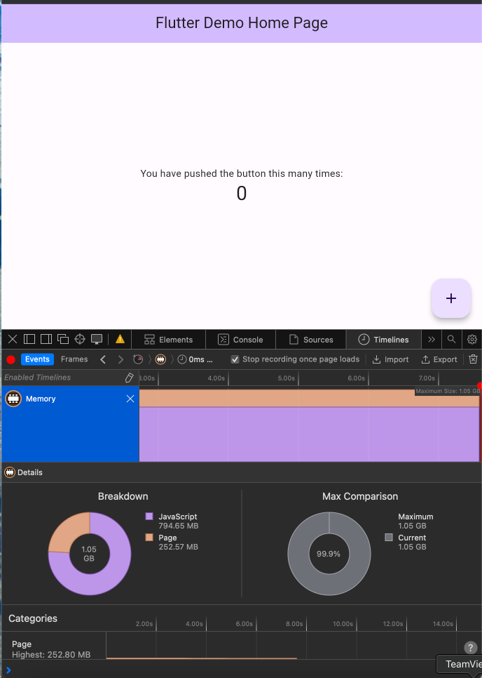

## Image 3: Basic Counter App on Safari iPad  
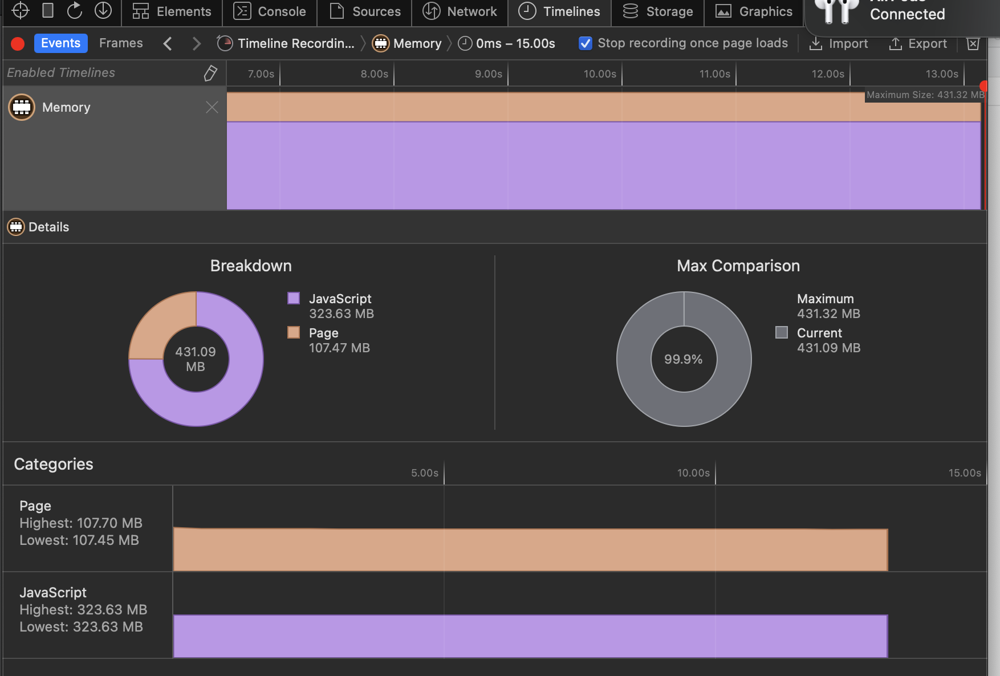

## Flutter 3.16.2
summery:
Mac Chrome: 39Mb
Mac Safari: 400Gb
Safari iPad: 431Mb
## Image 1: DI1 App on Mac Chrome  

## Image 2: DI1 App on Mac Safari  

## Image 3: DI1 App on Safari iPad  
