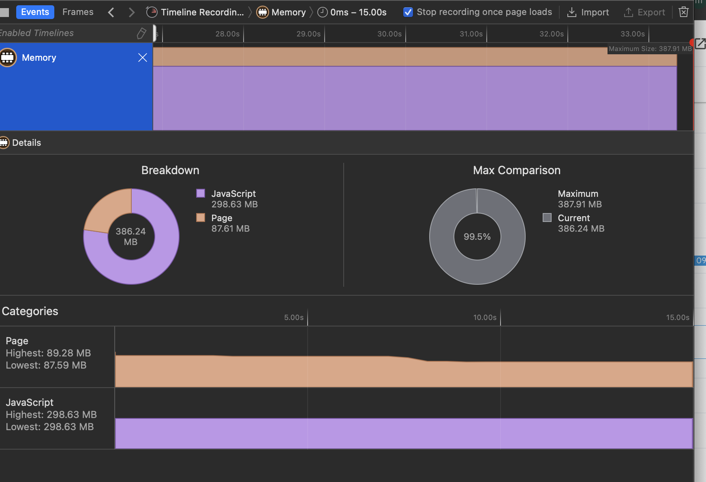

# Latest Flutter for Web Rendering issue

## Introduction
It's reveled that flutter has memory leaks issue with the latest versions used on web

Chrome version: Version 132.0.6834.160 (Official Build) (arm64)
Safari version: Version 18.2 (20620.1.16.11.8)
ipad Air M1 Ipad OS 18.2.1 

## Image 1: Basic counter app on Mac Chrome  


```markdown


Doctor summary (to see all details, run flutter doctor -v):
[✓] Flutter (Channel stable, 3.27.3, on macOS 15.2 24C101 darwin-arm64, locale en-US)
[✓] Android toolchain - develop for Android devices (Android SDK version 35.0.0)
[✓] Xcode - develop for iOS and macOS (Xcode 16.2)
[✓] Chrome - develop for the web
[✓] Android Studio (version 2024.2)
[✓] VS Code (version 1.96.4)
[✓] Connected device (5 available)
[✓] Network resources


## Image 2: Basic counter app on Mac Safari  


```markdown


Doctor summary (to see all details, run flutter doctor -v):
[✓] Flutter (Channel stable, 3.27.3, on macOS 15.2 24C101 darwin-arm64, locale en-US)
[✓] Android toolchain - develop for Android devices (Android SDK version 35.0.0)
[✓] Xcode - develop for iOS and macOS (Xcode 16.2)
[✓] Chrome - develop for the web
[✓] Android Studio (version 2024.2)
[✓] VS Code (version 1.96.4)
[✓] Connected device (5 available)
[✓] Network resources


## Image 3: Basic counter app on Safari Ipad  


```markdown


Doctor summary (to see all details, run flutter doctor -v):
[✓] Flutter (Channel stable, 3.27.3, on macOS 15.2 24C101 darwin-arm64, locale en-US)
[✓] Android toolchain - develop for Android devices (Android SDK version 35.0.0)
[✓] Xcode - develop for iOS and macOS (Xcode 16.2)
[✓] Chrome - develop for the web
[✓] Android Studio (version 2024.2)
[✓] VS Code (version 1.96.4)
[✓] Connected device (5 available)
[✓] Network resources